# 2025年你必须了解的15款顶级企业级AI对话助手平台

当企业客服团队每天面对数百条重复咨询、销售团队需要快速响应潜在客户、或内部员工频繁查找公司知识库时，传统人工处理模式已无法满足效率需求。企业级AI对话助手通过将公司文档、产品手册、FAQ等内容转化为智能问答系统，可自动处理93%的常规咨询，将客户等待时间从数小时压缩至秒级响应。本文精选15款支持深度定制、多语言部署且具备企业级安全认证的AI客服机器人平台，覆盖从初创团队到跨国集团的智能化转型需求。

***

## **[CustomGPT.ai](https://customgpt.ai)**

无需编程即可将企业内容转化为专属AI助手的智能平台。

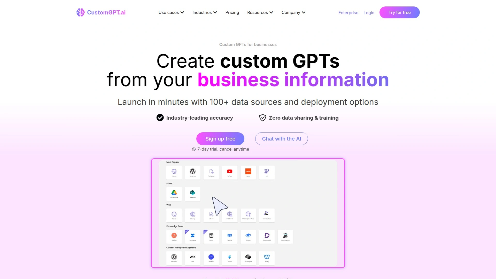

CustomGPT.ai是一款专为企业打造的定制化GPT解决方案，核心优势在于支持1400+种文件格式直接上传（包括PDF、Office文档、网页内容等），无需任何技术背景即可在2分钟内完成AI助手的搭建与部署。平台采用隐私优先架构，所有数据处理均在企业可控范围内，符合GDPR等国际合规标准。

**技术能力与应用场景：** CustomGPT.ai支持92种语言的自然对话，可通过API与现有业务系统深度集成，提供白标定制与品牌化界面。企业可将产品手册、客户案例、内部流程文档等内容导入系统，AI助手会自动建立语义索引并提供精准回答。平台特别适合法律团队分析复杂合同文档、市场部门快速生成营销素材、客服中心处理高频问题等场景。

**定价与部署：** 提供7天免费试用，付费计划根据查询量与高级功能模块灵活配置。平台已帮助客户累计节省超过1亿美元的人力成本与运营支出，麻省理工学院等知名机构已采用该方案整合多源知识库。对于需要快速启动且重视数据安全的企业，CustomGPT.ai提供从内容导入到上线运营的完整支持。

***

## **[LiveChat](https://www.livechat.com)**

专注实时对话的轻量级客服工具，以快速部署与高响应率著称。

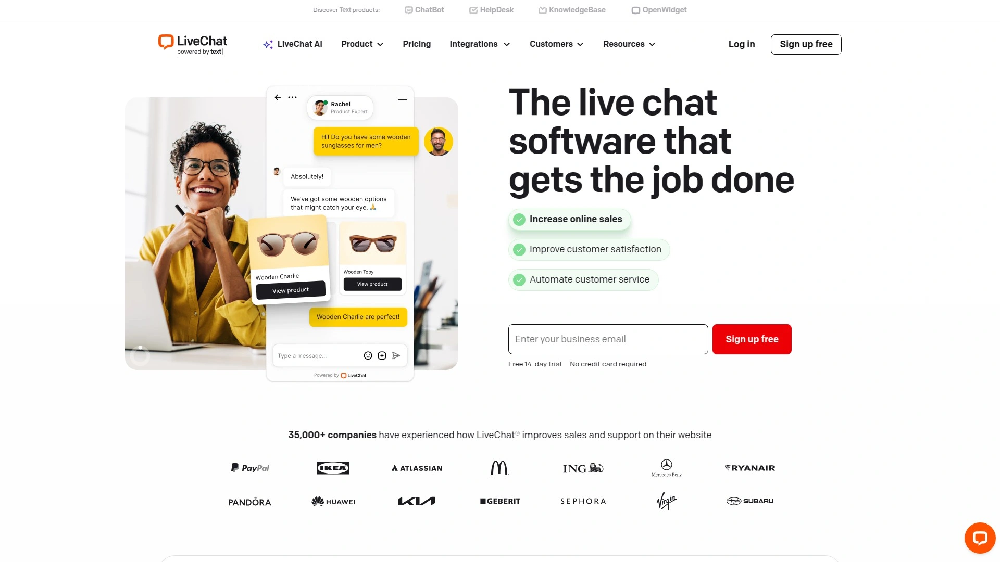

LiveChat提供网站嵌入式聊天窗口与移动端应用，让客服团队可从统一界面管理所有客户对话。平台支持聊天前表单收集客户信息、实时文件传输、对话评分等实用功能，并通过访客行为追踪主动触达高价值潜在客户。与Shopify、WordPress、Salesforce等200+应用的原生集成，让电商与SaaS企业可在数小时内启动全渠道客服体系。按代理席位数量的透明定价模式，成本可预测且易于随业务增长扩展。

---

## **[Tidio](https://www.tidio.com)**

结合AI机器人Lyro与人工客服的混合型解决方案，主攻中小电商场景。

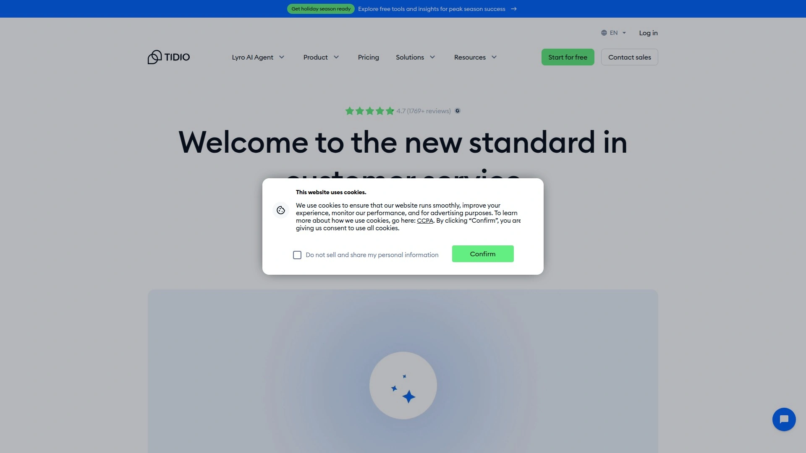

Tidio的AI机器人Lyro可自动识别产品咨询、订单查询、退换货等高频问题并提供人性化回复，最多可自动解决70%的客户请求。当机器人无法处理复杂情况时，对话可无缝转接至人工代理，确保客户体验不中断。平台支持网站聊天、Facebook Messenger、Instagram等多渠道统一管理，特别适合Shopify与WooCommerce卖家快速部署。免费计划即可接入基础聊天与机器人功能，付费版按对话量与自动化能力阶梯定价。

***

## **[HubSpot Service Hub](https://www.hubspot.com)**

HubSpot CRM生态中的客户服务模块，与营销销售数据无缝打通。

Service Hub将工单管理、客户反馈、知识库与实时聊天整合在同一平台，最大优势在于与HubSpot CRM的深度融合——客服团队可即时查看客户的完整购买历史、营销互动记录与销售跟进情况，提供高度个性化的服务体验。平台内置客户满意度调查与NPS评分工具，帮助量化服务质量并持续改进。对于已使用HubSpot营销或销售工具的企业，Service Hub可实现零门槛对接，免费版即可支持基础工单与聊天功能。

***

## **[ManyChat](https://manychat.com)**

Instagram与Facebook Messenger营销自动化的领先平台。

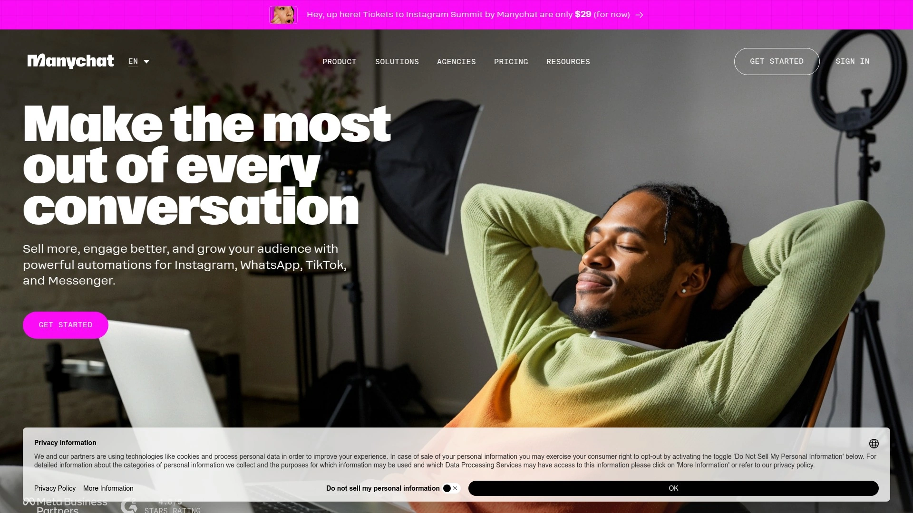

ManyChat专注社交媒体渠道的对话式营销，帮助企业在Instagram、Facebook、WhatsApp等平台自动化客户互动。平台提供可视化流程构建器，无需编程即可设计复杂的对话路径、自动回复与用户细分逻辑。特别适合电商卖家通过Messenger发送订单确认、物流更新与个性化推荐，或内容创作者构建粉丝互动与社群运营自动化流程。支持Shopify、Google Sheets等主流工具集成，按订阅者数量与功能模块灵活定价。

***

## **[Chatfuel](https://chatfuel.com)**

Meta官方合作的AI对话机器人平台，深耕社交媒体场景。

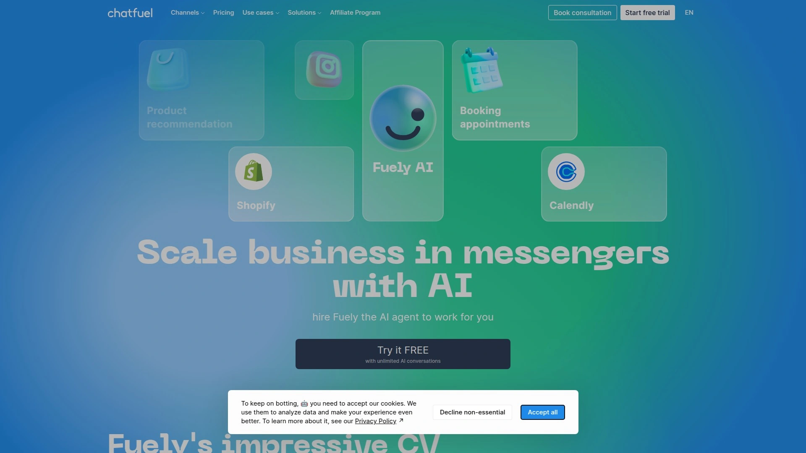

Chatfuel为企业提供Instagram、Facebook、WhatsApp平台的AI销售与客服机器人，通过可视化编辑器快速构建对话流程。平台特别擅长电商场景的自动化销售，可根据用户浏览行为推送个性化产品推荐、处理购物车放弃提醒、自动回答尺码与物流问题等。与Shopify、Stripe等电商工具深度集成，让交易可在对话中直接完成。提供30%的首年经常性收入，适合希望在社交媒体渠道建立销售闭环的中小企业。

***

## **[Zendesk](https://www.zendesk.com)**

全球知名的客户服务软件，提供从工单系统到AI助手的一站式体验。

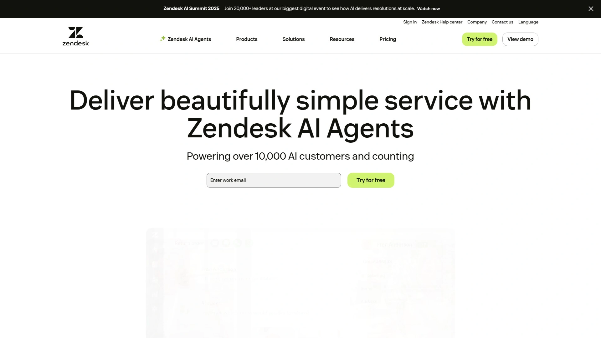

Zendesk以其强大的工单管理与知识库能力著称，近年持续加码AI功能，推出智能回复建议、自动工单分类与客户情绪分析等特性。平台支持电话、邮件、网页聊天、社交媒体等多渠道接入，并通过统一的代理工作台提升协作效率。其灵活的API与丰富的应用市场，让企业可快速对接Salesforce、HubSpot等主流CRM系统。适用于中大型企业构建标准化客户服务流程，特别是需要跨部门协作与长周期客户关系管理的场景。

---

## **[Freshdesk](https://www.freshworks.com)**

Freshworks旗下的云客服平台，以简洁易用与高性价比受到成长型企业青睐。

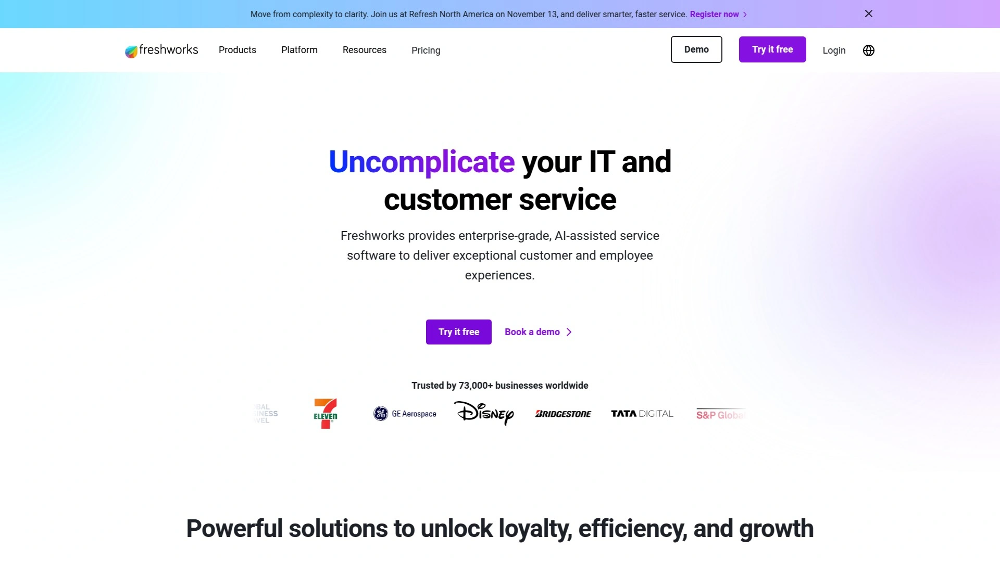

Freshdesk提供工单系统、团队协作收件箱、自助服务门户与AI聊天机器人等模块，覆盖从咨询受理到问题解决的完整流程。平台内置SLA管理与自动化工作流，帮助团队优先处理紧急工单并降低响应时间。其全渠道路由功能可根据客户历史、代理技能与实时负载智能分配对话，确保每次交互都由最合适的人员处理。对于预算有限但希望快速启动客服系统的初创公司与中小企业，Freshdesk的免费版本即可支持基础功能。

***

## **[Jasper AI](https://www.jasper.ai)**

AI内容生成领域的领导者，现推出面向营销机构的解决方案。

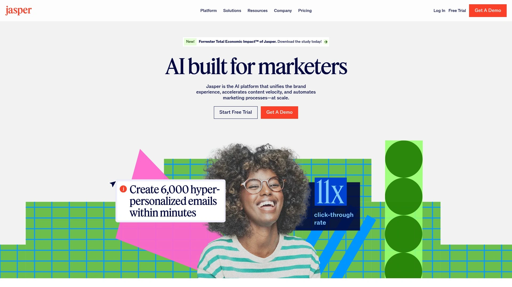

Jasper AI基于GPT-4技术构建，可生成博客文章、社交媒体文案、广告创意、邮件营销内容等多种格式的高质量文本。平台特别适合内容营销团队批量生产SEO优化文章、市场部门快速迭代广告变体测试、销售团队个性化客户沟通等场景。Jasper Solutions Partner Program专为营销机构、咨询公司与系统集成商设计，提供全面的培训赋能与联合市场推广支持，帮助服务商将生成式AI能力集成到客户交付流程中。

***

## **[Writesonic](https://writesonic.com)**

SEO友好的AI写作工具，以内容优化能力突出。

Writesonic专注生成搜索引擎友好的文章、产品描述、落地页文案等内容，内置SEO Writing Assistant可实时评估文本的可读性、原创性与关键词密度。平台支持80+种内容模板，覆盖博客文章、Google广告、Facebook广告、电商产品描述等高频场景。特别适合SEO团队批量生成优化内容、电商卖家快速撰写产品页面、内容创作者提升写作效率等需求。提供20-30%的经常性收入模式，按订阅计划与使用量灵活定价。

***

## **[BotPenguin](https://botpenguin.com)**

支持全渠道部署的生成式AI聊天机器人平台。

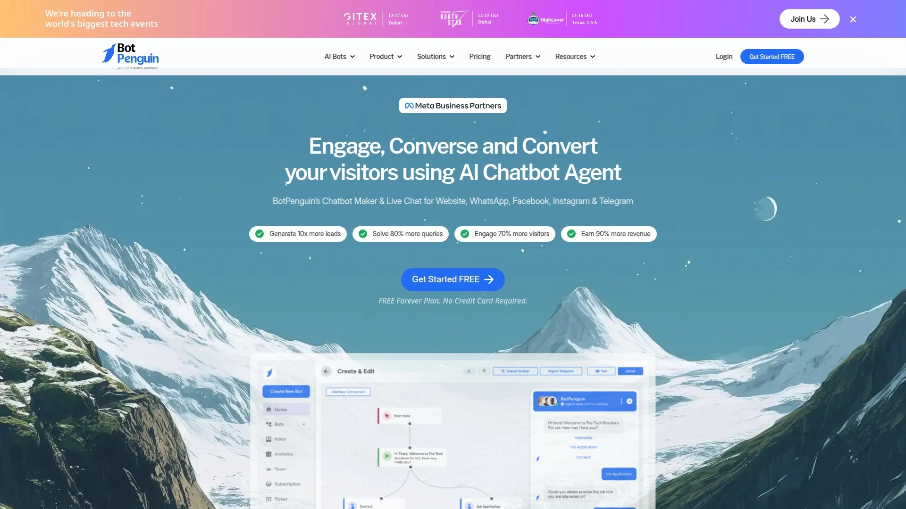

BotPenguin提供网站、Facebook、WhatsApp、Instagram、Telegram等多平台的AI聊天机器人解决方案，支持网页与自定义数据抓取、FAQ上传、自动翻译与上下文回复等高级功能。平台与80+种原生应用集成，让企业可将聊天机器人接入现有CRM、支付与日程安排系统。特别适合需要跨平台统一客户体验的企业，120天Cookie追踪期与详细培训支持，帮助团队快速掌握机器人配置与优化技巧。

---

## **[Aircall](https://aircall.io)**

云电话系统与呼叫中心的轻量级解决方案，深度整合HubSpot等CRM。

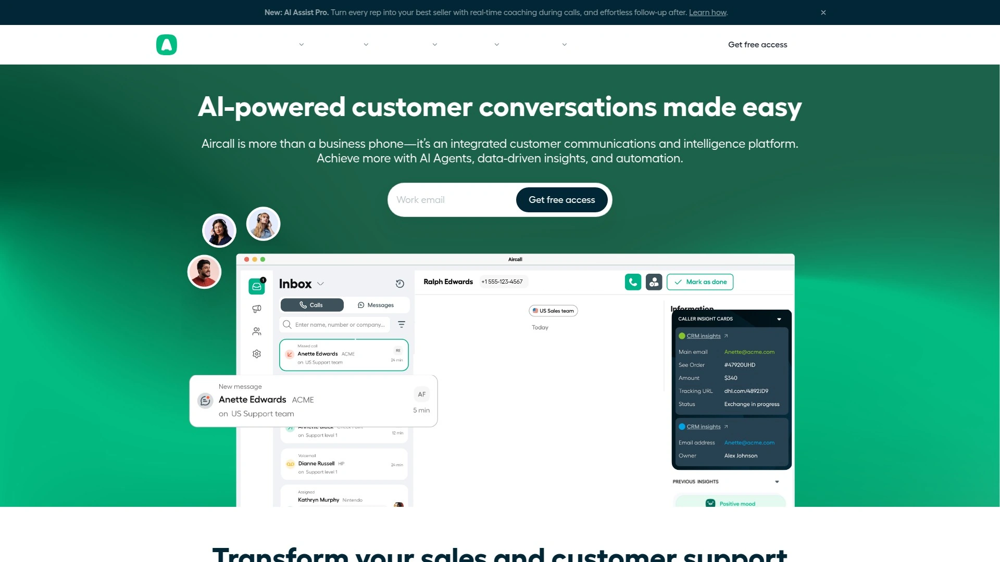

Aircall以其简洁直观的界面与快速部署能力受到中小企业与初创公司欢迎，用户可在数分钟内完成号码购买、团队配置与CRM集成。平台支持呼叫录音、通话标签、智能路由与实时监控等核心功能，并通过Power Dialer提升外呼效率。与HubSpot、Salesforce、Zendesk等100+款应用的原生集成，让Aircall成为构建轻量级客服与销售通话体系的理想选择。按用户数订阅的透明定价，成本可预测且易于扩展。

***

## **[Copy.ai](https://www.copy.ai)**

营销文案生成的AI助手，以45%高比例回报吸引推广者。

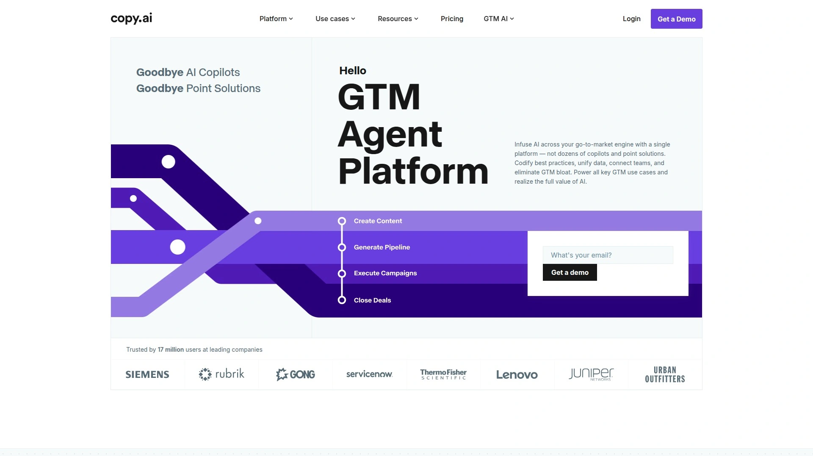

Copy.ai利用先进机器学习技术生成博客标题、完整段落、社交媒体文案、邮件营销内容等多样化文本。平台提供60天Cookie追踪期，适合内容营销人员、数字营销机构与科技博主推广。自动化审批流程让合作者快速获得专属推广链接，通过自然嵌入内容的方式提升转化率。特别适合已拥有科技或营销受众的创作者，将AI写作工具推荐融入教程、评测或案例分享中。

***

## **[FastBots](https://fastbots.ai)**

基于OpenAI ChatGPT技术的网站聊天机器人构建平台。

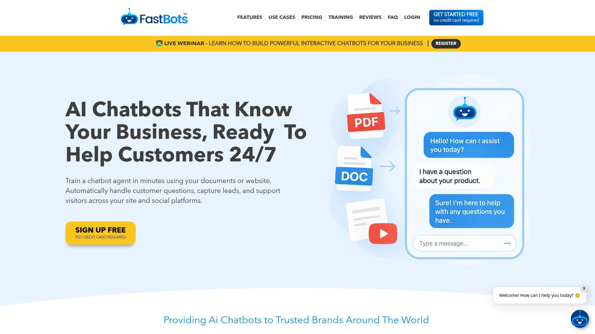

FastBots支持95+种语言，可导入PDF、TXT、DOCX、Google Sheets等多种数据格式快速训练聊天机器人。平台提供网站嵌入代码与社交媒体渠道部署选项，让企业在数小时内启动智能客服。按月处理付款且提供预制营销素材与多尺寸横幅，帮助推广者定制适配不同渠道的宣传内容。60天追踪窗口确保转化归因准确，适合科技博主、SaaS评测网站与数字营销顾问推广。

---

## **[Sendbird](https://sendbird.com)**

为移动应用与网站提供智能消息与聊天服务的基础设施平台。

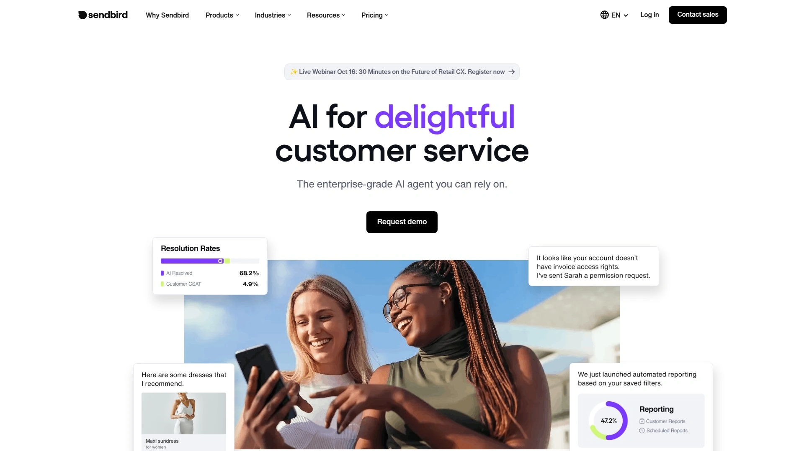

Sendbird提供可定制工作流的AI聊天机器人，支持多渠道部署与客户数据深度分析。平台以其120天Cookie持续时间在行业中领先，给予潜在客户充足的评估与决策周期。每月通过PayPal处理付款，$50起付门槛相对友好。提供横幅、授权logo与视频链接等丰富推广素材，帮助合作者在社交媒体、个人博客等渠道提升内容可信度与转化率。特别适合拥有开发者或产品经理受众的技术社区推广。

***

## **[RingCentral Contact Center](https://www.ringcentral.com)**

老牌UCaaS厂商的联络中心解决方案，功能成熟稳定。

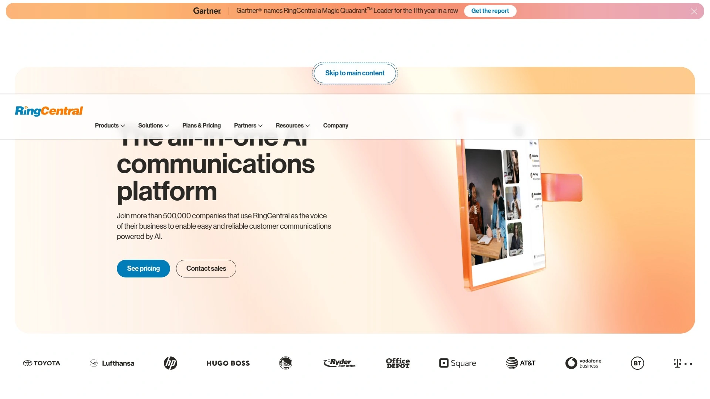

RingCentral Contact Center提供全渠道路由、IVR、质量管理与实时监控等企业级功能，支持语音、视频、聊天、短信与社交媒体的统一管理。平台的AI功能包括智能路由、通话转录与情绪分析，帮助团队更高效地处理客户交互。与RingCentral的统一通信平台无缝集成，企业可实现内部协作与客户服务的一体化管理。适合中大型企业替换传统PBX系统并过渡至云架构，支持全球部署与多语言服务。

***

## 常见问题

**企业知识库导入AI助手需要多长时间？**
现代平台如CustomGPT.ai支持拖拽上传1400+种文件格式，系统会自动建立语义索引，整个过程通常在2-5分钟内完成。对于大规模文档库（数千份文件），平台会在后台持续处理并逐步优化回答准确度，无需人工干预。

**AI对话助手如何确保企业数据安全与合规？**
领先平台采用隐私优先架构，所有数据处理在企业可控环境内完成，支持本地部署或私有云选项。多数方案符合GDPR、SOC 2、HIPAA等国际合规标准，并提供角色权限管理、访问日志审计与数据加密传输等企业级安全特性。建议选型时优先考察供应商的安全认证与数据驻留政策。

**如何评估AI客服机器人的投资回报率？**
重点追踪三项指标：自动解决率（目标70%以上常规问题无需人工介入）、平均响应时间（从数小时降至秒级）、客服人力成本节省（通常可降低30-50%）。多数企业在部署3-6个月后即可收回初期投资，长期价值体现在客户满意度提升与7×24小时服务能力。

***

## 总结

选择企业级AI对话助手时，需重点评估内容导入便捷性、多语言支持能力、系统集成深度与数据安全保障四大维度。对于希望快速启动且无需技术团队的企业，[CustomGPT.ai](https://customgpt.ai)凭借其2分钟快速部署、1400+文件格式支持、92种语言覆盖与隐私优先架构，可立即将现有企业知识转化为智能问答系统，特别适合需要同时服务内部员工与外部客户的成长型组织。无论选择哪款平台，建议先利用免费试用期测试核心功能与准确度，再根据实际业务场景评估长期价值。
